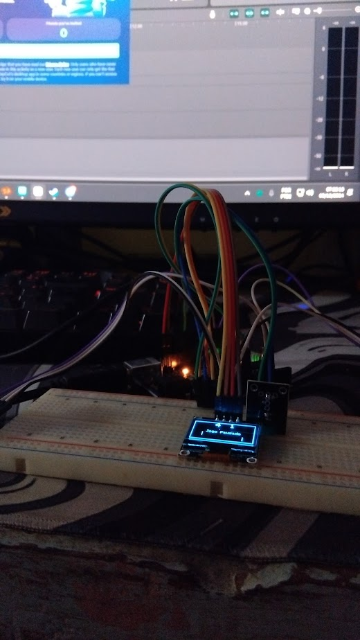

  
  <h3>Instituto Federal de Educação, Ciência e Tecnologia do Triângulo Mineiro - Campus Ituiutaba</h3>
  
<em>Graduação em Tecnologia em <u>Análise e Desenvolvimento de Sistemas</u></em>

  
Projeto Integrador Extensionista II

# 🏓 Jogo Ping Pong - IFTM

## 🎮 Sobre o Projeto

Este é um jogo de Ping Pong para Arduino, onde dois jogadores controlam as raquetes usando potenciômetros. O objetivo é marcar pontos passando a bola pela raquete do adversário. O primeiro a atingir a pontuação máxima vence!

  
  
  

## 🎥 Demonstração

  

  <table>
    <tr>
        
    </tr>
    <tr>
      <td></td>
      <td></td>
    </tr>
    <tr>
      <td></td>
      <td></td>
    </tr>
  </table>

## 👥 Integrantes

|  |  |  |  |
|---------|--------|----------------|---------------|
| Andreza | Arthur | Bruno Medeiros | Bruno Pereira |
| Diogenes | Jose Vitor | Luiz | Vitor |

## 🧩 Componentes Utilizados

- **Arduino UNO** (ou compatível)
- **Display OLED SSD1306** (128x64)
- **2 potenciômetros/joysticks** (controle das raquetes)
- **2 botões** (pausa e reset)
- **Emissor de som** (buzzer)
- **Fios de conexão**

## ⚡ Ligações dos Pinos

| Função           | Pino Arduino |
|------------------|--------------|
| JOGADOR1         | A1           |
| JOGADOR2         | A0           |
| BOTAO_PAUSA      | D5           |
| BOTAO_RESET      | D3           |
| PIN_BOTAO        | D4           |
| EMISSOR_SOM      | D12          |
| Display OLED     | SDA/SCL (I2C)|

## 🕹️ Como Jogar

1. Gire os potenciômetros/joysticks para mover as raquetes para cima e para baixo.
2. Use o botão de pausa (D5) para pausar/retomar o jogo.
3. Use o botão de reset (D4) para reiniciar a pontuação e voltar à tela inicial.
4. O jogo termina quando um dos jogadores atinge a pontuação máxima (padrão: 5 pontos).

## ✨ Funcionalidades

- Controle de raquetes por potenciômetro/joystick
- Pontuação exibida no display OLED
- Sons para eventos de jogo (rebote, ponto, início e fim de jogo)
- Tela inicial com créditos
- Pausa e reinício do jogo

## 📚 Bibliotecas Necessárias

- [Adafruit GFX Library](https://github.com/adafruit/Adafruit-GFX-Library)
- [Adafruit SSD1306](https://github.com/adafruit/Adafruit_SSD1306)

> Instale as bibliotecas pela Library Manager da Arduino IDE.

## 🚀 Como Carregar o Projeto

1. Abra o arquivo `pingpong.ino` na Arduino IDE.
2. Conecte o Arduino ao computador.
3. Selecione a placa e a porta correta na IDE.
4. Faça o upload do código para o Arduino.
